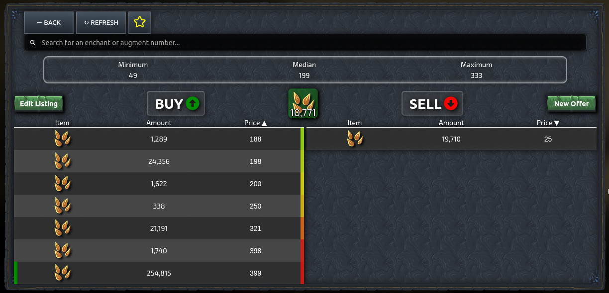

# Marketplace Tracker
**An [Idlescape](https://idlescape.com) extension**

Automatically tracks the marketprices for Idlescape using the [market API](https://idlescape.com/api/market/manifest). Prices are analyzed and displayed at various places in the game.

## Installation Options

Install the [Firefox Extension](https://addons.mozilla.org/en-US/firefox/addon/idlescape-marketplace-tracker/) from Mozillas Addon Store or

Install Tampermonkey for your browser ([Firefox](https://addons.mozilla.org/en-US/firefox/addon/tampermonkey/), [Chrome](https://chrome.google.com/webstore/detail/tampermonkey/dhdgffkkebhmkfjojejmpbldmpobfkfo)) and then install the [Userscript](https://raw.githubusercontent.com/IceFreez3r/marketplace-tracker/main/marketplace_tracker.user.js).

Please visit the marketplace once afterwards to initialize the extension.

## Features

### Marketplace
Adds the option to mark items as favorite, which highlights them in the market overview. Furthermore the heat item that had the best gold/heat ratio in the last API call is also highlighted in the overview. 

On the buy tab low cost items are highlighted in relation to the maximum price in the collected data:
- <95% of maximum price &rarr; red 🔴
- <80% of maximum price &rarr; yellow 🟡
- <60% of maximum price &rarr; green 🟢

There is also a popup when hovering entries, which shows you the theoretical profit if you would buy the entire stack and resell for max price. This is already on the [todo list](#planned-features) to be reworked. 

### Crafting
Shows the cost for buying all ingredients for a recipe compared to the cost of buying the crafted item directly.

We decided against a profit column here, since most of the recipes aren't profitable.

### Enchanting
Shows the cost for buying all ingredients for crafting a scroll compared to the cost of buying the scroll directly. The crafting costs also include the chance of success. Additionally there is a profit column, which already includes the 5% market fee.

### Smithing
Same thing once again. The last column is the profit, which includes the 5% market fee.

### Farming
Sorts the seeds based on their type into categories:
- Mysterious Seeds
- Single Slot Seeds
- Multi Slot Seeds

If you don't have a seed type an empty box is added, resulting in a grid, that has always the same size.

### Offline Summary
Adds up the value of all the items you acquired while offline and displays total and per hour information.

Note that the per hour information is only accurate if you are offline for a longer time and will always only be an estimate.

### Other
When ever the minimum or maximum price is shown, it is actually the 5%/95% quantile of the collected data. This step is done to reduce the impact of outliers. Otherwise a direct player trade with a price of only 1 gold, that manages to get into the API data, would make all computations pretty useless.

The data is stored on your computer in the `localStorage` of the browser. There is no exchange of data with any server.

To make sure, that the data of the extension isn't outdated, every API call is only stored for two weeks.

## Planned Features
(without any particular order)
- Marketplace
    - Toggle to only show the favorite items on the market overview page ⭐
    - Highlight items with a very low price in the last API call on the market overview page 📉
        - below current minPrice or below vendor price
    - Warning when selling items with less profit than the vendor price :warning:
    - new columns in the history
        - price per item
        - effective profit for sold items
    - Display gold/heat for heat items 🔥
    - Continous colors for low price items instead of categories and update the crappy popup 🌈
- Farming 🌽
    - Add a faded icon for missing seeds
    - Calculate the average profit for farming per seed (maybe even per enchantment)
    - Collect data for mysterious seeds and crack the algorithm behind them 
- Crafting
    - Show XP/Gold when selling on market or to vendor
    - store recipes to be able to highlight the best XP/Gold recipe
- Offline Tracker 😴
    - Improve offline time tracking
- Settings
    - Add a settings page 🔧

## Contact
If you have any questions, suggestions or comments, please open an [issue](https://github.com/IceFreez3r/marketplace-tracker/issues/new/choose) on GitHub or contact me over the official [Idlescape Discord](https://discord.com/invite/pwX6Xg5): IceFreez3r.
