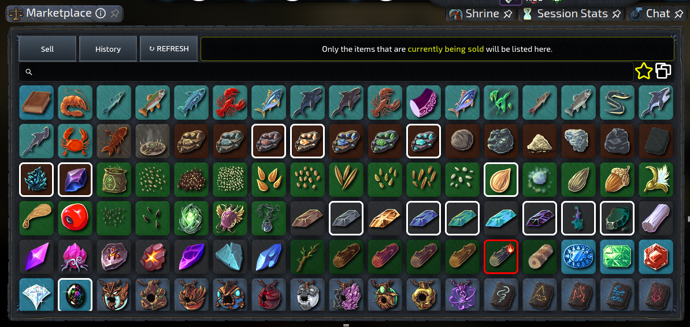
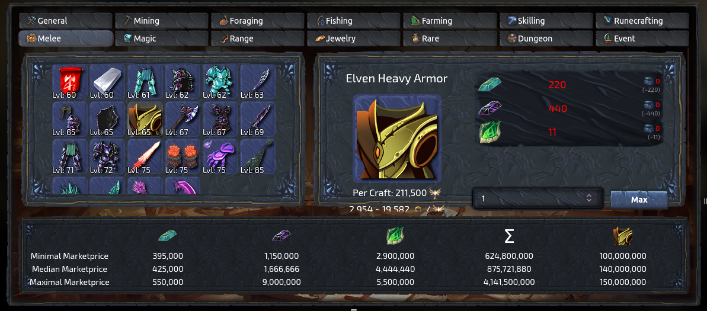

# Marketplace Tracker
**An [Idlescape](https://idlescape.com) extension**

Automatically tracks the marketprices for Idlescape using the [market API](https://idlescape.com/api/market/manifest). Prices are analyzed and displayed at various places in the game.

## Installation Options

Install the [Firefox Extension](https://addons.mozilla.org/en-US/firefox/addon/idlescape-marketplace-tracker/) from Mozillas Addon Store or

Install Tampermonkey for your browser ([Firefox](https://addons.mozilla.org/en-US/firefox/addon/tampermonkey/), [Chrome](https://chrome.google.com/webstore/detail/tampermonkey/dhdgffkkebhmkfjojejmpbldmpobfkfo), [Opera](https://addons.opera.com/en/extensions/details/tampermonkey-beta/)) and then install the [Userscript](https://raw.githubusercontent.com/IceFreez3r/marketplace-tracker/main/marketplace_tracker.user.js).

Please visit the marketplace once afterwards to initialize the extension.

## Features

### Marketplace
Adds the option to mark items as favorite, which highlights them in the market overview and lets you filter for them with a single button click. 
Furthermore the heat item that had the best gold/heat ratio in the last API call is also highlighted in the overview. 

Allows to define lower and upper limits for the price of items and sends desktop notifications when the price is within the defined range.

Adds a toggle to show the quantile of prices for items in the overview, such that it is instantly visible, if an item is cheap or expensive at the moment.

On the buy tab low cost items are highlighted in relation to the maximum price in the collected data:
- <95% of maximum price &rarr; red 🔴
- <80% of maximum price &rarr; yellow 🟡
- <60% of maximum price &rarr; green 🟢

There is also a popup when hovering entries, which shows you the theoretical profit if you would buy the entire stack and resell for max price. This is already on the [todo list](#planned-features) to be reworked. 

The history shows prices per item and tax-free prices for sold items.

### Crafting
Shows the cost for buying all ingredients for a recipe compared to the cost of buying the crafted item directly. Also calculates the amount of gold you would need per XP when crafting the selected item.

### Enchanting
Shows the cost for buying all ingredients for crafting a scroll compared to the cost of buying the scroll directly. The crafting costs also includes the chance of success.

### Smithing
Same thing once again. Compact prices to fit into the small space.

### Farming
Sorts the seeds based on their type into categories:
- Mysterious Seeds
- Single Slot Seeds
- Multi Slot Seeds

If you don't have a seed type an empty box with a faded image is added, resulting in a grid, that has always the same size. Seeds, that require a higher farming level than you have, have a darker image (not shown in the screenshot).

### Offline Summary
Adds up the value of all the items you acquired while offline and displays total and per hour information.

The Offline tracker also works with the Resource Tracker from [ISscripts](https://github.com/daelidle/ISscripts).

### Settings menu

All shown modules can be activated and deactivated through an additional settings menu. It is added into the sidebar, from where you have full control over all the modules.

Just as an example you can decide how profits are displayed in each module or deactivate them all together. (Profits always already include the market fee. No need to bring a calculator.)

In contrast to other userscripts you don't need to reload the page to apply changes.

### Other

Note that API prices are always at least 10 minutes outdated due to how the API works. The extension doesn't sync it's API requests with the updates of the API, meaning longer times are possible.

When ever the minimum or maximum price is shown, it is actually the 5%/95% quantile of the collected data. This step is done to reduce the impact of outliers. Otherwise a direct player trade with a price of only 1 gold, that manages to get into the API data, would make all computations pretty useless.

The data is stored on your computer in the `localStorage` of the browser. There is no exchange of data with any server.

API calls are only stored for two weeks, to make sure, that the data of the extension isn't outdated.

## Planned Features
(without any particular order)
- Marketplace
    - Scan the trade chat channel for cheap offers
    - Display gold/heat for heat items 🔥
    - Continous colors for low price items instead of categories and update the crappy popup 🌈
    - Customizable [filters](https://github.com/daelidle/ISscripts/blob/ac93a2c4d2b52f37ffaefd42e3dd54959d6c258a/assets/images/InventoryFilter/meta_image.png)
- Farming 🌽
    - Calculate the average profit for farming per seed (maybe even per enchantment)
    - Collect data for mysterious seeds and crack the algorithm behind them
        - It is already known, that the algorithm will change with the coming big update. Therefore low prio for now.
- Crafting
    - store recipes to be able to highlight the best XP/Gold recipe

## Contact
If you have any questions, suggestions or comments, please open an [issue](https://github.com/IceFreez3r/marketplace-tracker/issues/new/choose) on GitHub or contact IceFreez3r, Z3krom991 or Pinguinflieger over the official [Idlescape Discord](https://discord.com/invite/pwX6Xg5).
