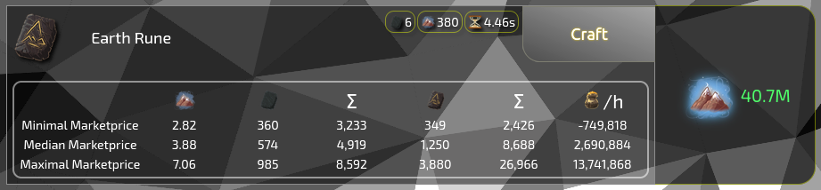
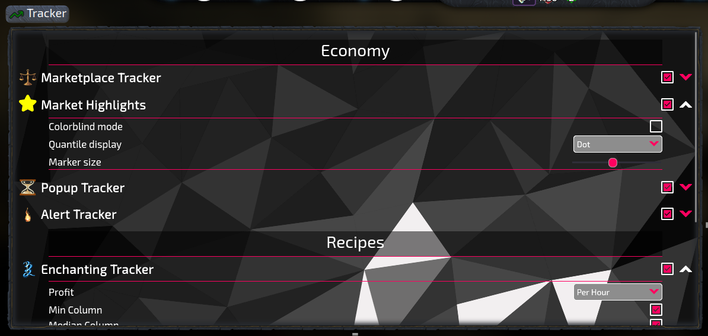

# Marketplace Tracker
**An [Idlescape](https://idlescape.com) extension**

Automatically tracks the marketprices for Idlescape using the [market API](https://idlescape.com/api/market/manifest). Prices are analyzed and displayed at various places in the game.

## Installation Options

Install the [Firefox Extension](https://addons.mozilla.org/en-US/firefox/addon/idlescape-marketplace-tracker/) from Mozillas Addon Store or

Install Tampermonkey for your browser ([Firefox](https://addons.mozilla.org/en-US/firefox/addon/tampermonkey/), [Chrome](https://chrome.google.com/webstore/detail/tampermonkey/dhdgffkkebhmkfjojejmpbldmpobfkfo), [Opera](https://addons.opera.com/en/extensions/details/tampermonkey-beta/)) and then install the [Userscript](https://raw.githubusercontent.com/IceFreez3r/marketplace-tracker/main/marketplace_tracker.user.js).

The userscript is mobile compatible. If you have a browser on your phone, that supports userscripts, you can use it there as well. I use [Firefox for Android](https://play.google.com/store/apps/details?id=org.mozilla.firefox&hl=en&gl=US) with [Tampermonkey](https://addons.mozilla.org/en-US/android/addon/tampermonkey/). Just note that the extension is not optimized for mobile use and the UI might look a bit weird at some places.

## Modules

### Marketplace

On the buy tab items are highlighted based on the quantile of their price.

### Highlights

Adds the option to mark items as favorite, which highlights them in the market overview and lets you filter for them with a single button click.
Furthermore the heat item with the current best gold/heat ratio is also highlighted in the overview.

Adds a toggle to show the quantile of prices for items in the overview, such that it is instantly visible, if an item is cheap or expensive at the moment.

### Popups

The total profit from offline progress, opened chests, dungeon loot, shared chests, ...

Adds up the value of all the items and displays total and (where applicable) per hour information.

This also works with the Resource Tracker from [ISscripts](https://github.com/daelidle/ISscripts).

### Alerts

Allows to define lower and upper limits for the price of items and sends desktop notifications when the price is within the defined range.

### Crafting

Shows the cost for buying all ingredients for a recipe compared to the cost of buying the crafted item directly. Also calculates the amount of gold you would need per XP when crafting the selected item.

### Enchanting
Shows the cost for buying all ingredients for crafting a scroll compared to the cost of buying the scroll directly.

### Smithing

Same thing once again.

### Runecrafting

Same thing once again. Also works for cloth.

## Settings menu

All shown modules can be activated and deactivated through an additional settings menu. You can access it from the sidebar.

Most of the modules come with their own settings.Just as an example you can decide how profits are displayed in each module or deactivate them all together. (Profits always already include the market fee. No need to bring a calculator.)

Changes are applied instantly without a required reload.

You can also export and import settings and market data here. This is useful if you want to share your settings with others or if you want to use the extension on multiple devices.

## Other

Note that API prices are always at least 10 minutes outdated due to how the API works. The extension doesn't sync it's API requests with the updates of the API, meaning longer times are possible.

When ever the minimum or maximum price is shown, it is actually the 5%/95% quantile of the collected data. This step is done to reduce the impact of outliers. Otherwise a direct player trade with a price of only 1 gold, that manages to get into the API data, would make all computations pretty useless.

The data is stored on your computer in the `localStorage` of the browser. There is no exchange of data with any server. The data is compressed (by about 99%) such that it doesn't hit the local storage quota.

API calls are only stored for two weeks, to make sure, that the data of the extension isn't outdated.

## Planned Features
(without any particular order)
- Marketplace
    - Scan the trade chat channel for cheap offers
    - Continous colors for low price items instead of categories and update the crappy popup 🌈
    - Customizable [filters](https://github.com/daelidle/ISscripts/blob/ac93a2c4d2b52f37ffaefd42e3dd54959d6c258a/assets/images/InventoryFilter/meta_image.png)
- Farming 🌽
    - Calculate the average profit for farming per seed (maybe even per enchantment)
- Crafting
    - store recipes to be able to highlight the best XP/Gold recipe

## Contact
If you have any questions, suggestions or comments, please open an [issue](https://github.com/IceFreez3r/marketplace-tracker/issues/new/choose) on GitHub or contact IceFreez3r, Z3krom991 or Pinguinflieger through the official [Idlescape Discord](https://discord.com/invite/pwX6Xg5). If you are a developer and want to contribute, please look into the [contribution guide](./CONTRIBUTING.md).
